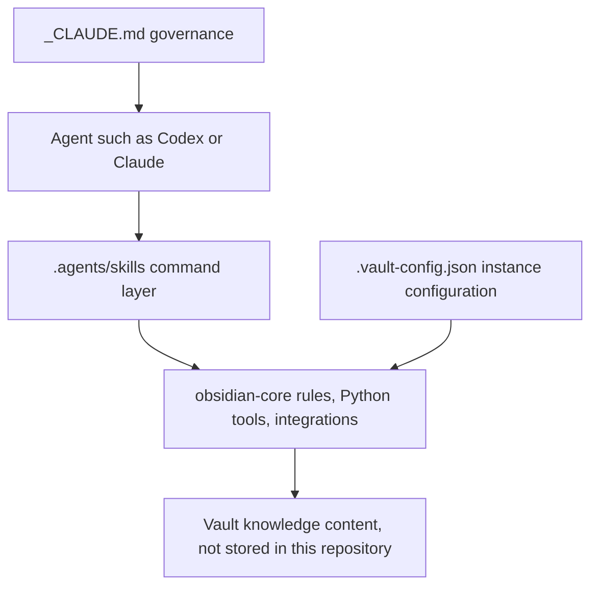
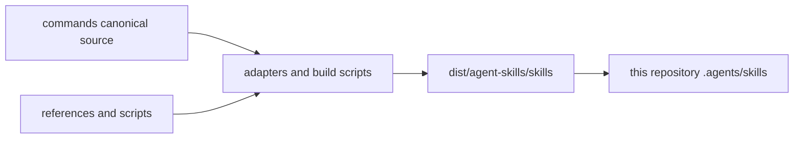

# Architecture

## System boundary

Cosmic Mindsea Knowledge System treats three deployed surfaces as one tool:

## Skill layer

There are 46 top-level Skill directories:

- one shared `obsidian-core` support tree;
- 45 command Skills such as capture, task, project, health, research, YouTube, podcast, review, and synthesis.

Each command directory exposes a `SKILL.md` that tells the Agent when and how to perform the operation. `obsidian-core` supplies shared AI-first rules, Python utilities, provider integration code, and the self-contained `uv` project.

## Governance layer

`_CLAUDE.md` defines how an Agent may read, create, propagate, or modify notes inside a Cosmic Mindsea instance. It is part of the tool because changing it changes system behavior even when the executable scripts remain unchanged.

## Configuration layer

`.vault-config.json` supplies instance-level settings. In this release it defines directories that Vault scanning should exclude.

## Source versus installed distribution

This repository is a cleaned installed distribution, not the complete upstream authoring tree. The upstream build path is conceptually:

Consequences:

- the current Skill files accurately represent the installed behavior;
- editing them can customize this distribution;
- generated wrappers may be overwritten when rebasing on a newer upstream release;
- general improvements should be implemented and tested against the full upstream repository where possible.

## Deployment boundary

`install.ps1` deploys only the Skill, governance, and configuration surfaces. It does not deploy or edit private knowledge directories. Existing managed surfaces are backed up before replacement.

