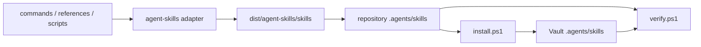

# Cosmic Mindsea Codex 适配仓库设计

**日期：** 2026-08-13

**目标仓库：** `MingTianYHS/Cosmic-Mindsea`

**上游项目：** `eugeniughelbur/obsidian-second-brain`
**状态：** 用户已批准混合方案，等待书面规格复核

## 1. 目标

将上游 `obsidian-second-brain` 中适用于 OpenAI Codex 的知识库管理能力整理为一个可公开迭代的 Codex 专用仓库，同时满足两种使用方式：

1. 克隆仓库后直接将预生成的 `.agents/skills/` 安装到 Obsidian Vault；
2. 修改平台无关的命令、参考资料或脚本后，重新生成 Codex Agent Skills。

目标仓库当前 `main` 分支内容将被整体替换，但替换前必须创建备份分支。不得修改或复制用户本地 `<PRIVATE_VAULT_PATH>` 知识库中的私人笔记、缓存、运行状态或密钥。

## 2. 范围

### 2.1 纳入仓库

- 上游平台无关源码：
  - `commands/`
  - `references/`
  - `scripts/`
  - `pyproject.toml`
  - `uv.lock`
- 当前推荐的 Agent Skills 构建适配器：
  - `adapters/lib.sh`
  - `adapters/agent-skills/adapter.sh`
- 预生成、可直接使用的 Codex Skills：
  - `.agents/skills/<skill-name>/SKILL.md`
  - `.agents/skills/obsidian-core/` 及其运行所需的 `references/`、`scripts/` 和 `pyproject.toml`
- Codex 和 Windows 使用入口：
  - `AGENTS.md`
  - `README.md`
  - `install.ps1`
  - `verify.ps1`
  - `.env.example`
  - `.gitignore`
  - `.gitattributes`
- 许可证与来源说明：
  - `LICENSE`
  - `NOTICE.md`

### 2.2 明确排除

- 已弃用的 `adapters/codex-cli/` 适配器；
- Claude Plugin、网站资源和其他非 Codex 平台适配器；
- 上游仓库中与构建或运行 Codex Skills 无关的发布资源；
- `<PRIVATE_VAULT_PATH>` 中的笔记、附件、日志、Obsidian 状态、缓存、运行时目录和备份；
- `.env`、API Key、Token、认证文件、虚拟环境、构建缓存和临时文件。

## 3. 仓库架构

```text
Cosmic-Mindsea/
├─ .agents/
│  └─ skills/
│     ├─ <command-skill>/
│     │  └─ SKILL.md
│     └─ obsidian-core/
│        ├─ SKILL.md
│        ├─ references/
│        ├─ scripts/
│        └─ pyproject.toml
├─ adapters/
│  ├─ lib.sh
│  └─ agent-skills/
│     └─ adapter.sh
├─ commands/
├─ references/
├─ scripts/
├─ docs/
│  └─ superpowers/
│     ├─ specs/
│     └─ plans/
├─ AGENTS.md
├─ README.md
├─ install.ps1
├─ verify.ps1
├─ pyproject.toml
├─ uv.lock
├─ .env.example
├─ .gitignore
├─ .gitattributes
├─ LICENSE
└─ NOTICE.md
```

### 3.1 源码层

`commands/`、`references/` 和 `scripts/` 是可维护的上游能力源。`adapters/agent-skills/adapter.sh` 负责将这些源文件转换成统一 Agent Skills 结构。后续迭代优先修改源码层，再重新构建 `.agents/skills/`，避免直接编辑生成产物造成漂移。

### 3.2 生成产物层

`.agents/skills/` 是面向 Codex 的直接安装产物。每个 Skill 目录必须包含 `SKILL.md`，其 YAML frontmatter 中的 `name` 必须与目录名一致。共享运行能力集中在 `obsidian-core`，命令 Skill 通过相对引用使用共享脚本和参考资料。

### 3.3 安装与验证层

`install.ps1` 接收目标 Vault 路径，将仓库中的 `.agents/skills/` 复制到该 Vault 的 `.agents/skills/`。脚本默认不删除目标 Vault 中仓库未管理的其他 Skills；若发生同名目录覆盖，必须先明确输出目标范围。

`verify.ps1` 对仓库或安装后的 Vault 执行结构检查，包括必需文件、frontmatter 名称、共享核心、相对路径和敏感文件排除检查。脚本不得修改被验证目录。

## 4. 数据流



构建流程只读取上游源码并写入隔离工作区。安装流程只有在用户主动运行 `install.ps1` 并提供 Vault 路径时才会写入 Vault；本次 GitHub 发布过程不调用安装脚本写入 `<PRIVATE_VAULT_PATH>`。

## 5. 发布策略

1. 获取上游默认分支的固定提交并记录来源 SHA；
2. 在隔离工作区生成并整理混合仓库；
3. 创建目标仓库备份分支 `backup/pre-codex-adaptation-2026-08-13`，指向替换前的 `main`；
4. 在发布分支准备一个以当前 `main` 为父提交的普通替换提交；
5. 该提交删除旧树并加入新树，不使用 `git reset --hard`，不强制推送，不改写既有历史；
6. 验证通过后将目标 `main` 快进到新提交；
7. 重新读取 GitHub 远端树，确认旧内容已移除且新内容完整。

## 6. 许可证与归属

- 保留上游 MIT `LICENSE` 中的原作者版权声明；
- `NOTICE.md` 明确注明代码和内容来源于 `eugeniughelbur/obsidian-second-brain`，并记录适配时采用的上游提交；
- `README.md` 将本仓库描述为 Codex-focused adaptation，不声称上游内容为完全原创；
- 新增的 Codex/Windows 包装脚本继续按仓库 MIT 许可证发布。

## 7. 错误处理与回滚

- 上游下载或构建失败：停止发布，不改变目标仓库；保留真实错误输出用于诊断；
- 生成结果结构不合法：停止发布，不提交不完整产物；
- 发现疑似密钥或私人 Vault 内容：停止发布，移除并重新扫描；
- 目标仓库分支状态发生变化：重新读取 `main` SHA，禁止基于过期父提交更新引用；
- 推送后验证失败：不宣称完成；根据问题创建修复提交。必要时可将 `main` 恢复到备份分支所指提交，但恢复属于新的外部写操作，需要再次说明影响。

## 8. 验收标准

只有以下检查全部通过，才能声称迁移完成：

1. 上游 `agent-skills` 构建命令退出码为 0；
2. 提交的 `.agents/skills/` 与重新构建结果一致；
3. 每个 Skill 目录均含 `SKILL.md`，frontmatter `name` 与目录名一致；
4. `obsidian-core` 的参考资料、脚本和依赖描述完整；
5. `install.ps1` 能在临时 Vault 中完成复制，且不触碰真实 Vault；
6. `verify.ps1` 对仓库和临时安装结果均返回成功；
7. 扫描未发现 `.env`、常见密钥格式、Token、缓存、虚拟环境或私人 Vault 内容；
8. `LICENSE` 与 `NOTICE.md` 正确保留上游归属；
9. GitHub 备份分支存在并指向替换前 `main`；
10. GitHub `main` 远端树只包含设计范围内的新项目内容；
11. 远端 `README.md`、`LICENSE`、`NOTICE.md` 和 `.agents/skills/` 可读取；
12. 本次操作未修改 `<PRIVATE_VAULT_PATH>`。

## 9. 非目标

- 本次不为知识库设计新的分类体系或笔记工作流；
- 本次不自动安装 Skills 到用户真实 Vault；
- 本次不发布包到 PyPI、npm 或其他注册表；
- 本次不建立自动同步上游的定时任务；
- 本次不保证除 Codex 之外的 agent 平台兼容性。
